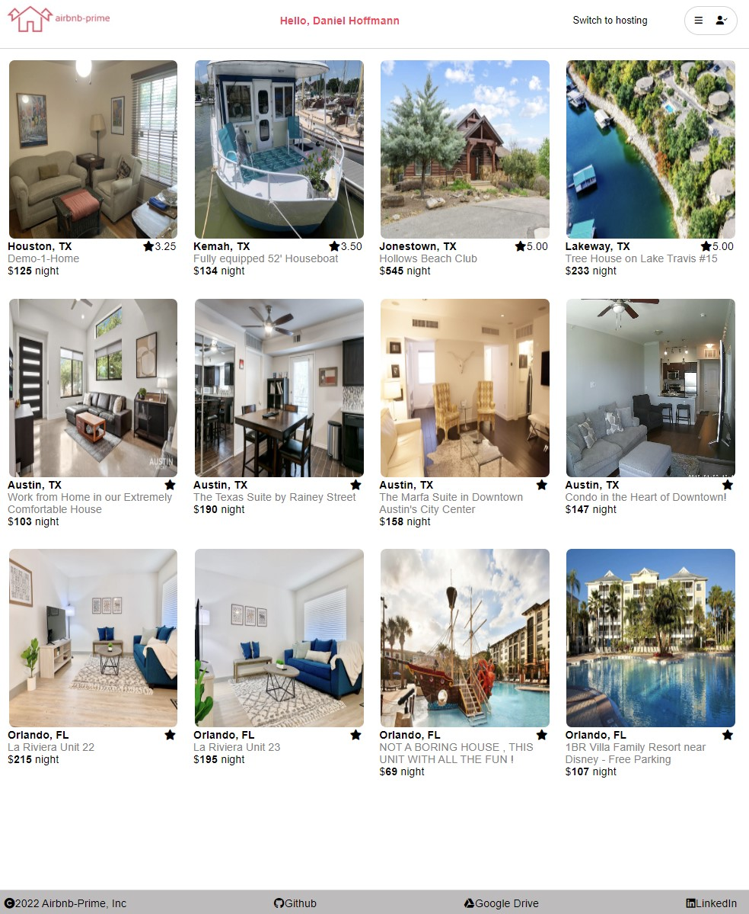
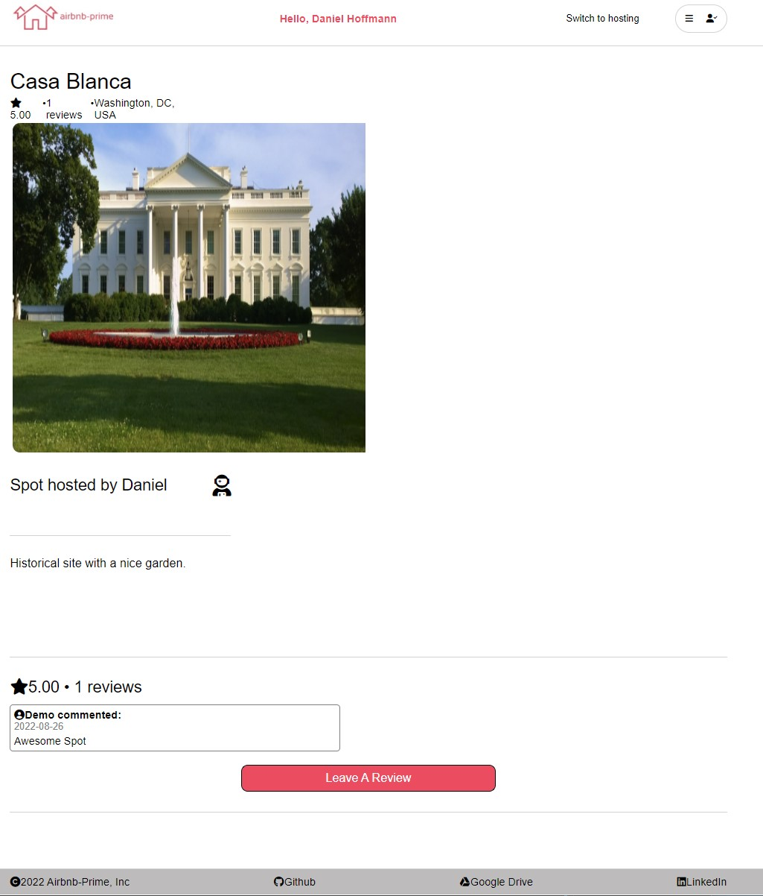
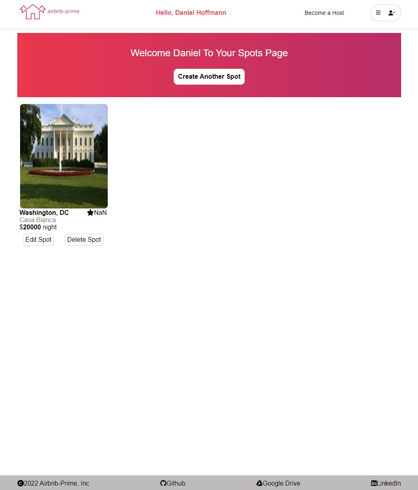

# Airbnb-Prime

## About
---

[Airbnb-Prime](https://airbnb-prime.herokuapp.com/) is a full-stack application clone of Airbnb deployed on Heroku.  The app uses React and Redux on the front-end and Express and Sequelize on the back-end.

### Features of App
* User Authentication required in order for users to be logged in to access certain features.
* Full CRUD features for Creating, Reading, Updating and Deleting of Spots.
* Full CRD features for Creating, Reading, and Deleting of Reviews on Spots.

 

## Technologies Used
----
### Front-end:
* Javascript
* React
* Redux
* Node.js
* HTML
* CSS

### Back-end:
* Javascript
* Express
* Sequelize
* PostgresSQL

 

## Application Preview
---
### Splash Page:

 

### Spot Details:

 

### Host Page:

 

## How to Launch
---
### Heroku
Feel free to explore the site on Heroku using this [Link](https://airbnb-prime.herokuapp.com/).

### Locally
If you would like to launch the site locally do the following:
